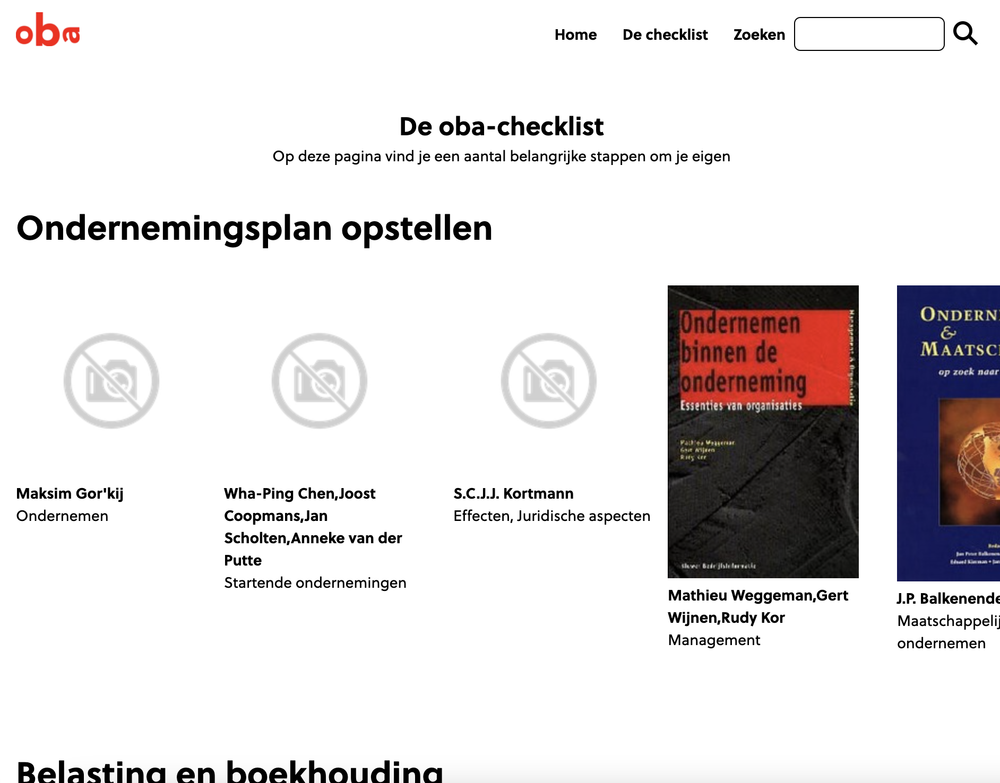
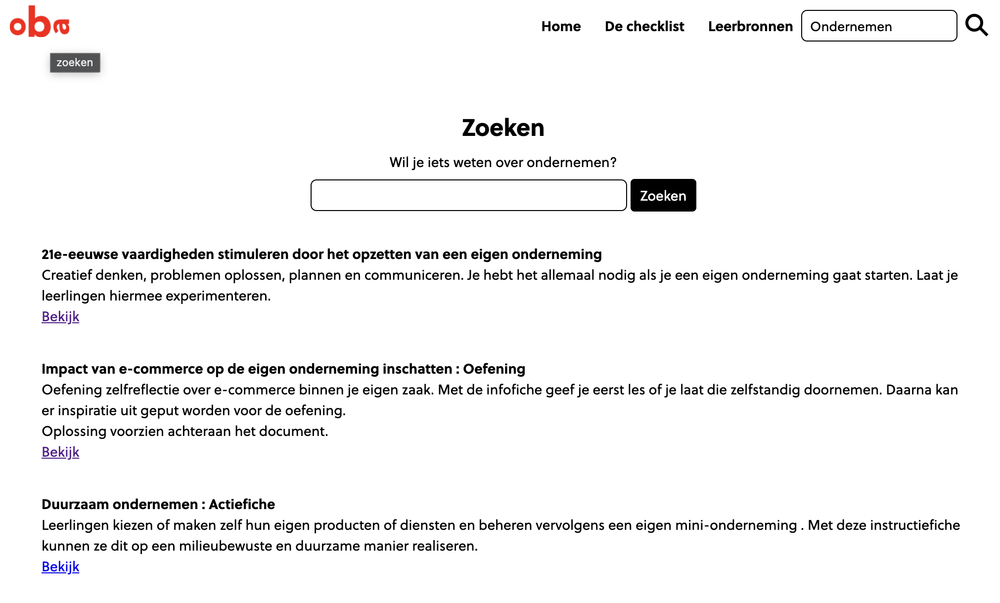

# Project oba

## 💡 Concept

### Curated books

The idea is to create a platform where young and venturous people can search for information to start their first business. Since you are new to this world, the oba has curated a list with interesting en useful books to help them start en learn their way into the businessworld.

### Teaching materials

Apart from the curated list, you can search within the public learning service of the oba where different teaching materials can be found. You can follow lessons en use some assignments to practice your skills.

## Visuals

<!-- Maybe a table of contents here? 📚 -->

## Installation

To install this project, clone this repository to a local directory. You can open the index.html in your browsers or setup a local http-server to serve the files to your laptop.

`git clone https://github.com/kaivwezel/project-1-2022`

## Wishlist

### 💭

- [ ] Make API work
- [ ] Refine design for oba
- [ ] Curate the lists more accurate
